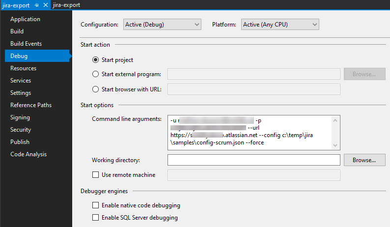

By showing your willingness to contribute, you will assist us and the community make this tool amazing.

There are many ways to contribute: logging bugs, creating suggestions and submitting pull requests.

# Did you find a bug?  
- **Ensure the bug was not already reported** by searching on GitHub under [Issues](https://github.com/solidify/jira-azuredevops-migrator/issues).
- If you're unable to find an open issue addressing the problem, [open a new one](https://github.com/solidify/jira-azuredevops-migrator/issues/new). Be sure to include a **title and clear description**, as much relevant information as possible, and a **code sample** or an **executable test case** demonstrating the expected behavior that is not occurring.

# Did you write a patch that fixes a bug or adds a new feature?  
- Open a new GitHub pull request with the patch/new feature.
- Ensure the PR description clearly describes the problem and solution. Include the relevant issue number if applicable.

# Contributing to code
After you have cloned the repo and built the project successfully on you local computer you're ready to start contributing!

## Prerequisites
In order to make a contribution you will need to have the following tools intalled:

* [Git](https://git-scm.com/)
* [Visual Studio 2019 (any edition)](https://visualstudio.microsoft.com/)

## Build and Run

Fork the repository and clone the code:

```
git clone https://github.com/<your-github-account>/jira-azuredevops-migrator.git
```

Next open the `src/WorkItemMigrator/WorkItemMigrator.sln` solution file, restore the nuget packages and then run build all. The local binaries can now be used to run migrations from the command line as usual.

## Debugging

To debug the tools, simply put the command line arguments used for a migration in the project setting's debug/start action, set the project as "startup project" and start debugging.



References:
* [Tutorial: Learn to debug C# code using Visual Studio](https://docs.microsoft.com/en-us/visualstudio/get-started/csharp/tutorial-debugger)
* [Project settings, debug tab](https://docs.microsoft.com/en-us/visualstudio/debugger/project-settings-for-csharp-debug-configurations?view=vs-2019#debug-tab)

## CI builds

The project has a CI/CD pipeline setup to produce build and publish releases to GitHub. The CI build yaml file for this project is committed to the repository but not intended to be used to build private builds, instead either build locally or submit a pull request.